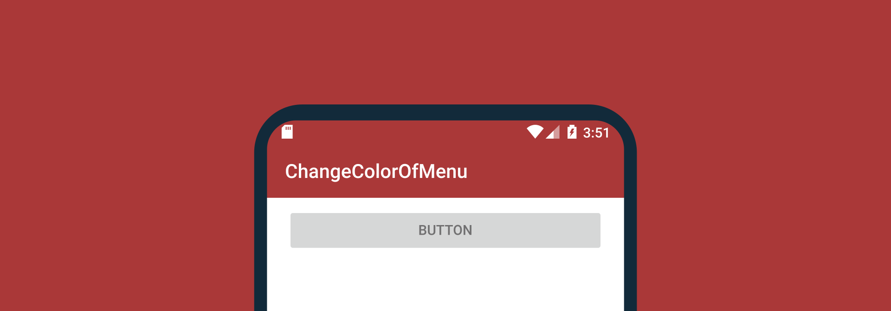
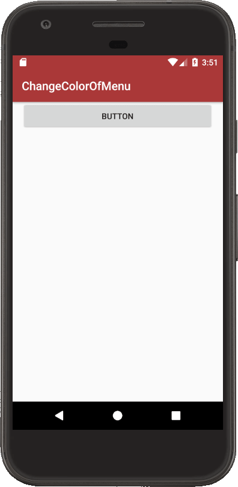

# Change the color of ActionBar and StatusBar in the Android app



An article on how to dynamically change the color of the `StatusBar` and `ActionBar` elements.

The color of the status bar can be changed by code:

```java
getSupportActionBar().setBackgroundDrawable(
        new ColorDrawable(Color.parseColor(color)));
```

The color of the main panel ' StatusBar` can be changed via the method:

```java
public void setStatusBarColor(String color) {
    if (Build.VERSION.SDK_INT >= Build.VERSION_CODES.LOLLIPOP) {
        Window window = getWindow();
        int statusBarColor = Color.parseColor(color);
        if (statusBarColor == Color.BLACK && window.getNavigationBarColor() == Color.BLACK) {
            window.clearFlags(WindowManager.LayoutParams.FLAG_DRAWS_SYSTEM_BAR_BACKGROUNDS);
        } else {
            window.addFlags(WindowManager.LayoutParams.FLAG_DRAWS_SYSTEM_BAR_BACKGROUNDS);
        }
        window.setStatusBarColor(statusBarColor);
    }
}
```

An example of an application where clicking the button changes the color of both components (without the `package` line):

```java
import android.graphics.Color;
import android.graphics.drawable.ColorDrawable;
import android.os.Build;
import androidx.appcompat.app.AppCompatActivity;
import android.os.Bundle;
import android.view.View;
import android.view.Window;
import android.view.WindowManager;
import android.widget.Button;


public class MainActivity extends AppCompatActivity {

    Button button;

    @Override
    protected void onCreate(Bundle savedInstanceState) {
        super.onCreate(savedInstanceState);
        setContentView(R.layout.activity_main);

        button = (Button) findViewById(R.id.button);
        button.setOnClickListener(new View.OnClickListener() {
            @Override
            public void onClick(View v) {
                String color = "#AA3939";

                setStatusBarColor(color);

                getSupportActionBar().setBackgroundDrawable(
                        new ColorDrawable(Color.parseColor(color)));
            }
        });
    }

    public void setStatusBarColor(String color) {
        if (Build.VERSION.SDK_INT >= Build.VERSION_CODES.LOLLIPOP) {
            Window window = getWindow();
            int statusBarColor = Color.parseColor(color);
            if (statusBarColor == Color.BLACK && window.getNavigationBarColor() == Color.BLACK) {
                window.clearFlags(WindowManager.LayoutParams.FLAG_DRAWS_SYSTEM_BAR_BACKGROUNDS);
            } else {
                window.addFlags(WindowManager.LayoutParams.FLAG_DRAWS_SYSTEM_BAR_BACKGROUNDS);
            }
            window.setStatusBarColor(statusBarColor);
        }
    }
}
```

```xml
<?xml version="1.0" encoding="utf-8"?>
<LinearLayout xmlns:android="http://schemas.android.com/apk/res/android"
    android:layout_width="match_parent"
    android:layout_height="match_parent"
    android:paddingLeft="16dp"
    android:paddingRight="16dp"
    android:orientation="vertical" >

    <Button
        android:id="@+id/button"
        android:layout_width="match_parent"
        android:layout_height="wrap_content"
        android:text="Button" />
</LinearLayout>
```



_Figure 1: Running application_
